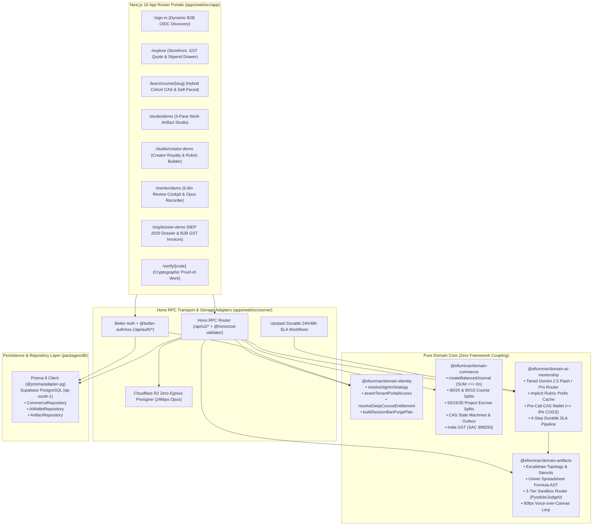

# Elluminar v2 (`Practitionist/elluminar-v2`)

> **Clean-Sheet Hexagonal Monolith for Applied Engineering Mastery, Multimodal Work Artifact Verification, True Double-Entry Escrow Accounting & India B2B Enterprise Compliance (`SAC 999293`).**

---

## 1. Architectural Vision & Why v2 Was Reconstructed Clean-Sheet

**Elluminar v2** was engineered from first principles as a zero-compromise, clean-sheet successor to v1. Rather than patching an entangled legacy monolith, v2 establishes strict hexagonal domain boundaries, deterministic integer financial arithmetic (`BigInt` minor units / paisa), and sub-8% gross AI COGS invariants.

### v1 Legacy Monolith vs. v2 Clean-Sheet Hexagonal Architecture

| Architectural Dimension | Legacy v1 Monolith (`familiarise`) | Elluminar v2 Clean-Sheet (`elluminar-v2`) |
| :--- | :--- | :--- |
| **Schema Surface Area** | **110 bloated Prisma models** with circular ORM hooks, nullable money floats, and mixed consumer/enterprise tables | **38 razor-sharp core domain models** (+ 9 Better Auth / junction support tables) strictly normalized around immutable journals, entitlements, and artifacts |
| **Domain Isolation** | Tightly coupled UI components mutating database rows directly inside route handlers | **Hexagonal Monorepo (`apps/*` + `packages/*`)** where pure domain packages have **zero HTTP/UI coupling** and zero dependency on `familiarise` |
| **Authentication & B2B SSO** | Ad-hoc session tokens with cross-tenant domain leakage risks | **`better-auth` + `@better-auth/sso`** with Dynamic OIDC Discovery (`resolveSignInStrategy`), strict consumer email domain blocklist (`gmail`, `outlook`, `yahoo`, `icloud`, `googlemail`), and dual-store session ban purging |
| **Financial Core & Splits** | Mutable balance columns vulnerable to race conditions and rounding drift | **True Double-Entry Ledger** (`SUM(amountMinor) === 0n` per journal), explicit `ESCROW_LOCKED` vs `AVAILABLE` buckets, deterministic `80/20` & `90/10` Course splits, and `50% Mentor / 15% Author IP Royalty / 35% Platform` Project Escrow splits |
| **Concurrency Control** | Unsynchronized updates vulnerable to double webhook fulfillment and double refunds | **Optimistic Compare-And-Swap (`CAS`) State Machines** (`version = expectedVersion + 1`), Cohort capacity locks, and Idempotent Outbox deduplication |
| **Tax & Invoicing** | Unstructured receipts | **Gapless India B2B GST Engine (`SAC 999293`)** computing exact Intra-State (`CGST 9% + SGST 9%`) vs Inter-State (`IGST 18%`) tax invoices (`ELM/INV/YYYY-YY/NNNNNN`) |
| **Work Artifacts & AI Economics** | Unbounded raw text prompts blowing up LLM unit economics | **AST & Topology Extractors** (`Excalidraw` graph, `Univer` formula vs literal AST, `$0` client WASM `Pyodide` worker, `24kbps Opus` Voice-over-Canvas R2 replay) paired with **Pre-Call CAS `AiWallet` reservations (`<= 8%` gross SKU COGS ceiling)** |

---

## 2. Hexagonal Monorepo Architecture

All domain business rules live inside pure, side-effect-free TypeScript packages (`packages/domain-*`) that are exhaustively unit-tested without network or database overhead. Persistence adapters live in `packages/db`, while transport routes (`Hono` RPC `/api/v2/*`) and Next.js 16 App Router portals live in `apps/web`.



---

## 3. Workspace Package Inventory

| Package / App | Path | Responsibility |
| :--- | :--- | :--- |
| **`@elluminar/web`** | `apps/web` | Next.js `16.4+` App Router portals, Hono `/api/v2` RPC server, Better Auth + `@better-auth/sso` adapter, Cloudflare R2 presigner, and Web Worker hooks (`useBrowserSandboxWorker`, `useOpusVoiceRecorder`). |
| **`@elluminar/db`** | `packages/db` | Prisma 8 schema & PostgreSQL (`@prisma/adapter-pg`, `ap-south-1`) client, strict Zod environment schema (`env.ts`), and domain repositories (`commerce-repository.ts`, `ai-wallet-repository.ts`, `artifact-repository.ts`). |
| **`@elluminar/domain-identity`** | `packages/domain-identity` | Dynamic B2B OIDC domain discovery (`sso-discovery.ts`), Multi-Tenant Portal RBAC guards & dual-store session ban purge plans (`rbac.ts`), and Default-Deny `OrgLicense` entitlement resolution (`entitlements.ts`). |
| **`@elluminar/domain-commerce`** | `packages/domain-commerce` | Double-Entry Ledger engine (`ledger.ts`), Course (`80/20`, `90/10`) & Project (`50/15/35`) split calculators, Tenant-scoped coupons, Optimistic CAS transitions (`cas-fulfillment.ts`), Webhook Outbox deduplication (`outbox.ts`), and India B2B GST engine (`gst.ts`). |
| **`@elluminar/domain-artifacts`** | `packages/domain-artifacts` | Excalidraw architectural topology & dangling arrow detector (`excalidraw.ts`), Domain stencil packs & Socratic node highlighter (`stencils.ts`), Univer spreadsheet formula vs hardcoded literal AST inspector (`spreadsheet.ts`), 3-Tier Sandbox execution router (`sandbox-protocol.ts`), and 60fps Voice-over-Canvas binary search frame interpolator (`voice-replay.ts`). |
| **`@elluminar/domain-ai-mentorship`** | `packages/domain-ai-mentorship` | Weighted Rubric evaluation engine (`index.ts`), Tiered Gemini model router (`gemini-2.5-flash` vs `gemini-2.5-pro`) & 3 Outcome Engines (`engines.ts`), Pre-Call CAS `AiWallet` reservation & settlement (`wallet-cas.ts`), Guarded `@google/genai` client (`gemini-client.ts`), and Upstash Durable 24h/48h SLA workflow pipeline (`sla-workflow.ts`). |

---

## 4. Interactive Clean-Sheet Portals Directory

When running locally (`pnpm dev`), the following end-to-end interactive portals showcase the live domain invariants:

| Route Path | Portal Role | Key Architectural Features Demonstrated |
| :--- | :--- | :--- |
| **`/`** | Landing Overview | Live server-rendered `computeProjectEscrowSplit(1000000n)` (`50/15/35`) and `calculateIndiaGstBreakdown` (`SAC 999293`, Inter-State `IGST 18%`) cards with portal navigation. |
| **`/sign-in`** | Identity & B2B SSO | Live corporate email domain discovery (`resolveSignInStrategy`), blocking consumer domains (`gmail.com`, `outlook.com`, `yahoo.com`, `icloud.com`, `googlemail.com`) from claiming Enterprise OIDC while routing verified `@tech-gcc.example.com` tenants to `/org/[slug]/sso`. |
| **`/explore`** | Outcome Storefront | Interactive catalog with live `80/20` Marketplace vs `90/10` Direct Link splits, `50/15/35` Project Escrow breakdowns, `CGST 9% + SGST 9%` vs `IGST 18%` tax drawer, tenant-scoped coupons, and `₹0` free scholarship bypass (`FREE_COMPLETED`). |
| **`/learn/course/[slug]`** | Hybrid Course Player | Switch seamlessly between `LIVE_COHORT` (backed by `reserveCohortSeatCas` optimistic capacity lock) and `SELF_PACED` mastery modes, with direct milestone handoff into the Artifact Studio. |
| **`/studio/demo`** | Learner Studio | 3-Pane Work Artifact Studio featuring `DISTRIBUTED_BACKEND` & `AGENTIC_RAG` Excalidraw stencil packs, client-side `$0` WASM `Pyodide` Python runner, `Univer` DCF Formula vs Hardcoded literal AST inspector, and 60fps Voice-over-Canvas synchronized playback. |
| **`/studio/creator-demo`** | Creator Studio | Interactive simulator for `15%` passive Author IP Royalty + `90/10` Direct referral splits, static Gemini Rubric Cache prefix composer, and `assertTenantPortalAccess` role matrix (`OWNER` vs `INSTRUCTOR`/`TA` financial mutation blocks). |
| **`/mentor/demo`** | Mentor Cockpit | Compressed 5–8 minute review workflow powered by AI Engine 2 (`MentorBriefThreeBulletSummary`), weighted criterion sliders (`weightBps === 10000`), live `24kbps Opus` Voice + Laser Pointer keyframe recorder, and `50%` Mentor Escrow release preview on `PASS`. |
| **`/org/dossier-demo`** | B2B & University Console | Print-ready (`@media print`) NEP 2020 / AICTE 14–20 Credit Academic Compliance Dossier & gapless `SAC 999293` GST Tax Invoice (`ELM/INV/2026-27/000042`) generator. |
| **`/verify/[code]`** | Public Proof-of-Work | Tamper-evident public verification page displaying SHA-256 Work Artifact digests, Principal Mentor rubric breakdown, and Engine 3 Oral Defense verification status. |

---

## 5. Local Development, Typechecking, Testing & Build Guide

### Prerequisites

- **Node.js**: `>= 22.18.0` (verified on `v22.23.3`)
- **Package Manager**: `pnpm@12.10.1` (workspace root uses a single canonical `node_modules`)
- **Database**: PostgreSQL 16+ / Supabase (`ap-south-1` Mumbai) via `@prisma/adapter-pg`

### Step-by-Step Commands

```bash
# 1. Install workspace dependencies at the monorepo root
pnpm install

# 2. Generate the Prisma 8 client (@elluminar/db)
pnpm db:generate

# 3. Run strict TypeScript typechecking across all packages and Next.js routes
pnpm typecheck

# 4. Run the full deterministic Vitest suite across all domain & server packages
pnpm test

# 5. Build the production monorepo via Turborepo
pnpm build

# 6. Start the local Next.js + Hono development server (http://localhost:3000)
pnpm dev
```

---

## 6. Low-Level Architecture Documentation (`docs/architecture/`)

Every critical subsystem in `elluminar-v2` is documented in detail with sequence diagrams, state machines, mathematical proofs, and code contracts inside `docs/architecture/`:

1. **[01 — Identity, Dynamic B2B OIDC SSO, Multi-Tenant RBAC & Entitlements](./docs/architecture/01-identity-sso-and-rbac.md)**
   - Dynamic B2B Domain Discovery (`resolveSignInStrategy`) & Consumer Email Domain Blocklist (`PERSONAL_EMAIL_DOMAINS`).
   - Multi-Tenant Portal RBAC Guards (`assertTenantPortalAccess` across `/studio/[slug]`, `/org/[slug]`, and `/mentor`).
   - Default-Deny `ALLOWLIST` `OrgLicense` Seat Scoping (`resolveDeepCourseEntitlement`).
   - Atomic Dual-Store Session Ban Purging (`buildSessionBanPurgePlan` across PostgreSQL & Upstash Redis).
2. **[02 — True Double-Entry Ledger, Revenue Splits, Optimistic CAS & India GST](./docs/architecture/02-commerce-ledger-cas-and-gst.md)**
   - Double-Entry Accounting Invariant (`SUM(amountMinor) === 0n` via `createBalancedJournal`) & `ESCROW_LOCKED` vs `AVAILABLE` bucket semantics.
   - Course Revenue Splits (`80/20` Marketplace vs `90/10` Creator Direct Link) & 3-Way Project Escrow (`50% Mentor` + `15% Author IP Royalty` + `35% Platform`).
   - Optimistic Compare-And-Swap (`CAS`) State Machines (`executeCasOrderTransition`, `executeCasRefundTransition`, `reserveCohortSeatCas`) & Webhook Outbox Deduplication (`evaluateWebhookOutboxIdempotency`).
   - Gapless India B2B GST Engine (`SAC 999293`, Intra-State `CGST 9% + SGST 9%` vs Inter-State `IGST 18%`).
3. **[03 — Pluggable Work Artifacts, Tiered Gemini AI Economics & Durable SLA Workflows](./docs/architecture/03-artifacts-ai-and-sla-workflows.md)**
   - Excalidraw Topology & Dangling Connector Extractor, Domain Stencils, Univer DCF Formula vs Hardcoded Literal AST Inspector, `$0` WASM `Pyodide` Sandbox Router, and `24kbps Opus` Voice-over-Canvas R2 Presigned Replay.
   - Tiered Gemini Routing (`gemini-2.5-flash` with Implicit Rubric Prefix Caching vs `gemini-2.5-pro` Oral Defense Generator).
   - Pre-Call Optimistic CAS `AiWallet` Credit Reservation & Settlement (`<= 8%` Gross SKU COGS Ceiling).
   - Upstash Durable `24h` (`TIER_2`) / `48h` (`TIER_1`) Mentor SLA Escalation Pipeline (`orchestrateMilestoneReviewPipeline`).
