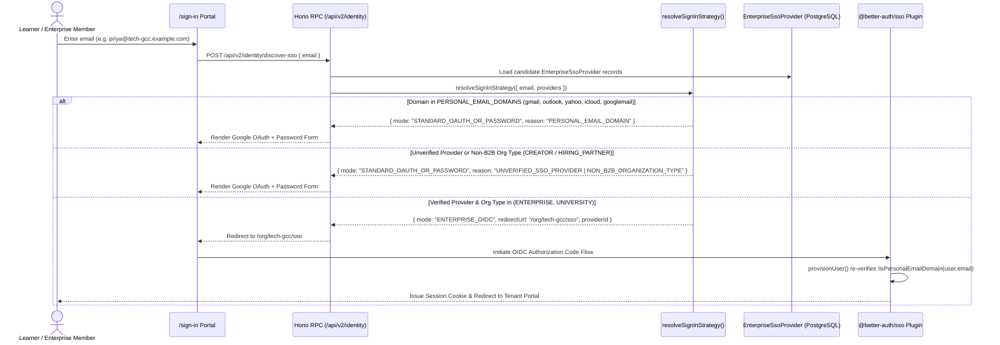
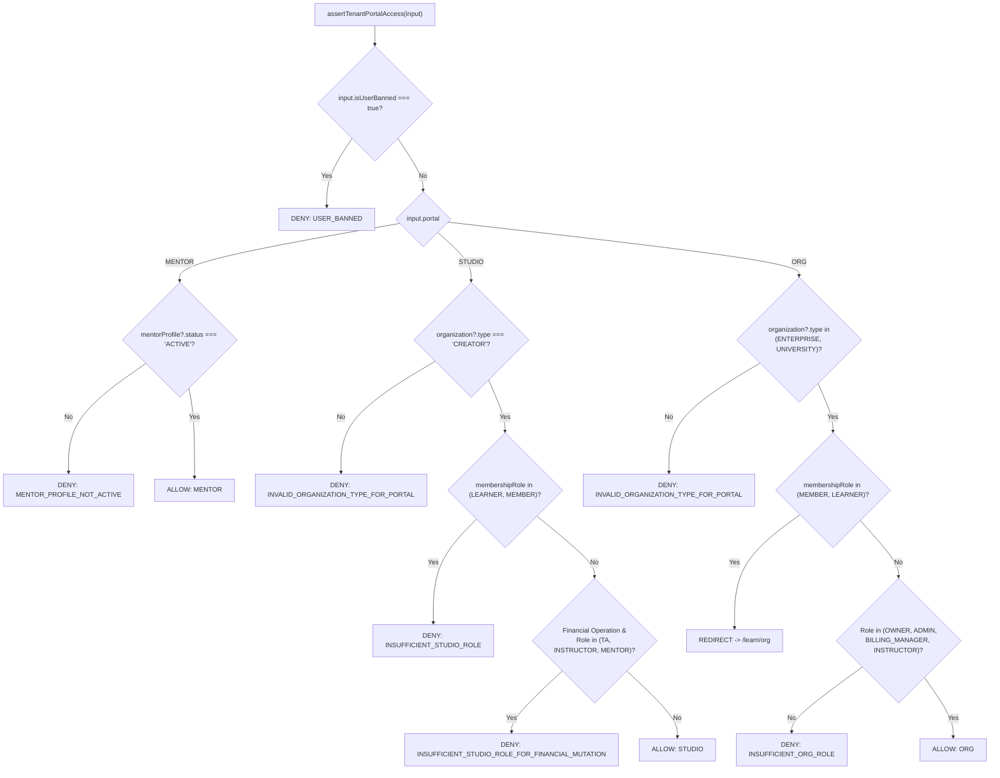

# 01 — Identity, Dynamic B2B OIDC SSO, Multi-Tenant RBAC & Entitlements

> **Package Scope**: `@elluminar/domain-identity` (`packages/domain-identity/src/*`) & Better Auth Adapter (`apps/web/src/lib/auth.ts`)

---

## 1. Design Philosophy & Zero-Trust Boundaries

Elluminar v2 serves consumer learners, independent creators, industry mentors, and enterprise/university B2B cohorts inside a single unified application without allowing identity or authorization bleed across tenant types.

All identity policy decisions are implemented as **pure, deterministic domain functions** in `@elluminar/domain-identity`:

| Module File | Core Exported Primitives | Primary Security Invariant |
| :--- | :--- | :--- |
| `src/sso-discovery.ts` | `resolveSignInStrategy`, `extractEmailDomain`, `isPersonalEmailDomain`, `PERSONAL_EMAIL_DOMAINS` | Consumer domains (`gmail.com`, `googlemail.com`, `outlook.com`, `yahoo.com`, `icloud.com`, etc.) can **never** claim or route to B2B Enterprise OIDC/SAML SSO. |
| `src/rbac.ts` | `assertTenantPortalAccess`, `buildSessionBanPurgePlan` | Enforces strict portal-to-`OrganizationType` binding (`/studio/[slug]` = `CREATOR`, `/org/[slug]` = `ENTERPRISE \| UNIVERSITY`, `/mentor` = `MentorProfile.status === "ACTIVE"`), blocks `TA`/`INSTRUCTOR` financial mutations, and generates atomic PostgreSQL + Redis session ban purges. |
| `src/entitlements.ts` | `resolveDeepCourseEntitlement` | Enforces **Default-Deny `ALLOWLIST`** semantics on `OrgLicense` seats (`courseIds: []` grants **0** courses) and validates temporal & revocation constraints. |

---

## 2. Dynamic B2B OIDC Domain Discovery (`resolveSignInStrategy`)

When a user enters their email on `/sign-in`, Elluminar v2 deterministically resolves whether to initiate an enterprise OIDC/SAML handshake (`/org/[slug]/sso`) or render standard Google OAuth / Email + Password authentication.

### 2.1 Consumer Email Blocklist (`PERSONAL_EMAIL_DOMAINS`)

To prevent catastrophic multi-tenant domain hijacking—where a rogue or misconfigured tenant registers a shared consumer email domain—the following domains are permanently blocked at three layers (`resolveSignInStrategy`, `@better-auth/sso` `provisionUser`, and `databaseHooks.ssoProvider.create.before`):

- **Google**: `gmail.com`, `googlemail.com`
- **Microsoft**: `outlook.com`, `hotmail.com`, `live.com`, `msn.com`
- **Yahoo**: `yahoo.com`, `ymail.com`
- **Apple**: `icloud.com`, `me.com`, `mac.com`
- **Privacy / Consumer Mail**: `proton.me`, `protonmail.com`, `aol.com`, `zoho.com`, `hey.com`

### 2.2 Sequence Diagram: Dynamic Domain Discovery & Triple-Layer Consumer Guard



---

## 3. Multi-Tenant Portal RBAC Guards (`assertTenantPortalAccess`)

Every route under `/studio/[slug]`, `/org/[slug]`, and `/mentor` evaluates `assertTenantPortalAccess(input)` prior to rendering server components or executing Hono mutations.

### 3.1 Portal Isolation & Operation Scope Matrix

| Target Portal | Required `Organization.type` / Profile | Permitted Read Roles | Financial Mutations (`BILLING_MUTATION`, `PAYOUT_MUTATION`, `COUPON_MUTATION`) | Special Redirection / Denial Behavior |
| :--- | :--- | :--- | :--- | :--- |
| **`STUDIO`** (`/studio/[slug]`) | `Organization.type === "CREATOR"` | `OWNER`, `ADMIN`, `BILLING_MANAGER`, `INSTRUCTOR`, `TA`, `MENTOR` | Strictly restricted to **`OWNER`**, **`ADMIN`**, **`BILLING_MANAGER`**. (`TA`, `INSTRUCTOR`, `MENTOR` denied with `INSUFFICIENT_STUDIO_ROLE_FOR_FINANCIAL_MUTATION`) | `LEARNER` and `MEMBER` roles are hard-denied (`INSUFFICIENT_STUDIO_ROLE`). |
| **`ORG`** (`/org/[slug]`) | `Organization.type` in `("ENTERPRISE", "UNIVERSITY")` | `OWNER`, `ADMIN`, `BILLING_MANAGER`, `INSTRUCTOR` | Enforced via org admin scopes (`OWNER`, `ADMIN`, `BILLING_MANAGER`) | Plain **`LEARNER`** / **`MEMBER`** users receive `{ action: "REDIRECT", to: "/learn/org", reason: "LEARNER_MEMBER_REDIRECT_TO_LEARN_PORTAL" }`. |
| **`MENTOR`** (`/mentor/*`) | `MentorProfile.status === "ACTIVE"` | Verified Active Mentor | Scoped to mentor's own `ESCROW_LOCKED` / `AVAILABLE` payout ledger | `PENDING_REVIEW`, `SUSPENDED`, or `INACTIVE` mentors are denied with `MENTOR_PROFILE_NOT_ACTIVE`. |

### 3.2 Decision Flowchart: `assertTenantPortalAccess`



---

## 4. Default-Deny `ALLOWLIST` `OrgLicense` Seat Scoping (`resolveDeepCourseEntitlement`)

Enterprise and University customers purchase seat pools (`OrgLicense` + `LicenseSeat`) scoped either to `ALL` catalog items or an explicit curated `ALLOWLIST`.

A critical security bug in legacy B2B platforms occurs when an unconfigured `ALLOWLIST` (`courseIds: []`) accidentally defaults to open access. In `resolveDeepCourseEntitlement`:

1. **Direct Learner Enrollment Priority**: Checks if the user holds an individual `Enrollment` with `status in ("ACTIVE", "COMPLETED")`.
2. **Default-Deny `ALLOWLIST` Evaluation**:
   - If `license.scopeMode === "ALLOWLIST"`, `coversCourse` evaluates strictly as:
     ```ts
     license.scopeMode === "ALLOWLIST" &&
       license.courseIds.length > 0 &&
       license.courseIds.includes(params.courseId)
     ```
   - An empty `courseIds` array (`[]`) grants access to **0 courses** (`NO_ENTITLEMENT_OR_EMPTY_ALLOWLIST`).
   - Validates `license.seatRevokedAt == null` (`LICENSE_SEAT_REVOKED`) and `license.validFrom <= now <= license.validUntil` (`LICENSE_EXPIRED_OR_NOT_YET_VALID`).
3. **Preview Lesson Fallback**: Unentitled users can only view sub-routes where `subRoute.kind === "LESSON" && subRoute.isPreview === true` (`grantSource: "PREVIEW_LESSON"`). Cohort discussions (`COHORT_DISCUSSION`) and milestone submissions (`ASSIGNMENT`) never admit preview bypasses.

---

## 5. Atomic Dual-Store Session Ban Purging (`buildSessionBanPurgePlan`)

Because Better Auth sessions can be cached in both PostgreSQL (`Session` table) and low-latency edge key-value storage (Upstash Redis), banning a compromised or abusive account (`user.banned = true`) requires immediate dual-store invalidation so active bearer tokens cannot survive until TTL expiry.

`buildSessionBanPurgePlan` produces a deterministic execution plan:

```ts
export interface SessionBanPurgePlan {
  shouldPurge: boolean;
  userId: string;
  postgresDeleteWhere: { userId: string } | null;
  sessionIds: string[];
  redisKeysToDelete: string[];
}
```

When `user.banned === true`, the purge plan atomically targets:
1. **PostgreSQL Primary**: `DELETE FROM "Session" WHERE "userId" = $1` (`postgresDeleteWhere: { userId: user.id }`).
2. **Upstash Redis Session Cache**:
   - User session index set: `elluminar:user-sessions:<userId>`
   - Every active session token key: `better-auth:session:<token>`
