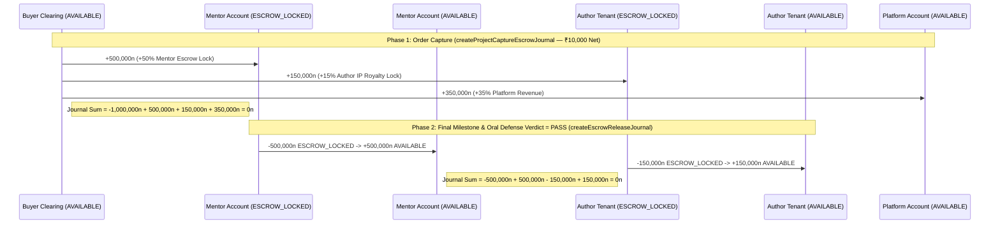
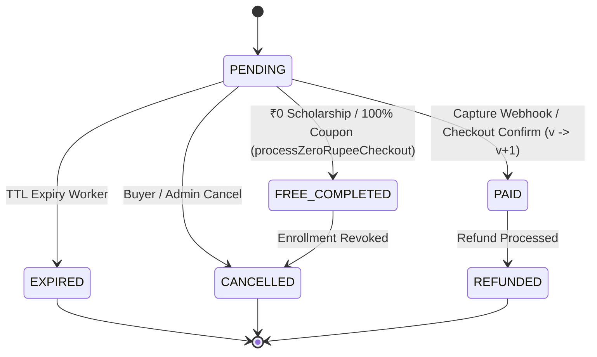

# 02 — True Double-Entry Ledger, Revenue Splits, Optimistic CAS & India GST

> **Package Scope**: `@elluminar/domain-commerce` (`packages/domain-commerce/src/*`) & Commerce Repository (`packages/db/src/repositories/commerce-repository.ts`)

---

## 1. Fundamental Double-Entry Accounting Invariant (`SUM(amountMinor) === 0n`)

Elluminar v2 replaces mutable balance columns with an append-only **True Double-Entry Ledger** (`LedgerAccount`, `LedgerJournal`, `LedgerEntry`). All monetary values are represented exclusively in signed 64-bit integer minor units (`bigint` paisa: `₹1.00 = 100n`)—eliminating IEEE-754 floating-point drift across multi-party splits and tax invoices.

Every journal constructed by `createBalancedJournal` enforces three mathematical invariants before freezing its payload:

1. **Non-Empty Idempotency Key**: Every journal carries a deterministic `idempotencyKey` (e.g. `project-capture-escrow:<orderId>`, `project-escrow-release:<projectInstanceId>`) preventing duplicate postings across webhook retries.
2. **Minimum Two Non-Zero Legs**: `entries.length >= 2` and every `entry.amountMinor !== 0n`.
3. **Zero-Sum Conservation Law**:
   $$\sum_{i=1}^{N} \text{entry}_i.\text{amountMinor} \equiv 0\text{n}$$
   Any imbalance immediately throws `DoubleEntryInvariantError`.

---

## 2. Revenue Splits & 3-Way Project Escrow Lifecycle

### 2.1 Course Revenue Splits (`computeCourseRevenueSplit`)

Courses settle directly upon payment capture according to the attribution channel:

| Split Tier (`CourseSplitTier`) | Creator Share (`creatorBps`) | Platform Share (`platformBps`) | Arithmetic Formula (Integer Paisa) |
| :--- | :---: | :---: | :--- |
| **`STANDARD_80_20`** (Marketplace Discovery) | **80.00%** (`8000 bps`) | **20.00%** (`2000 bps`) | `creator = (net * 8000n) / 10000n`, `platform = net - creator` |
| **`CREATOR_DIRECT_90_10`** (Creator Referral Link) | **90.00%** (`9000 bps`) | **10.00%** (`1000 bps`) | `creator = (net * 9000n) / 10000n`, `platform = net - creator` |

### 2.2 3-Way Project Escrow Split (`computeProjectEscrowSplit`)

Applied capstone projects involve three distinct economic stakeholders: the **Human Mentor** who conducts the 5–8 minute milestone & oral defense review, the **Creator Studio (`TENANT`)** who authored the project blueprint & rubric IP, and the **Elluminar Platform**.

To align incentives with verified learner outcomes, Mentor and Author shares are locked in **`ESCROW_LOCKED`** accounts upon order capture and released to **`AVAILABLE`** withdrawal accounts exclusively when the learner achieves a final **`PASS`** verdict:

| Stakeholder Account | Ledger Owner & Bucket at Capture | Share (`bps`) | Sample `₹10,000.00` (`1,000,000n` paisa) | Release Condition to `AVAILABLE` |
| :--- | :--- | :---: | :---: | :--- |
| **Buyer Clearing Account** | `USER` (`AVAILABLE`) | `-100.00%` | `-1,000,000n` (`-₹10,000.00`) | Debited at capture |
| **Assigned Mentor Escrow** | `MENTOR` (`ESCROW_LOCKED`) | **`+50.00%`** (`5000 bps`) | `+500,000n` (`+₹5,000.00`) | Released via `createEscrowReleaseJournal` when `verdict === "PASS"` |
| **Author Studio IP Royalty** | `TENANT` (`ESCROW_LOCKED`) | **`+15.00%`** (`1500 bps`) | `+150,000n` (`+₹1,500.00`) | Released via `createEscrowReleaseJournal` when `verdict === "PASS"` |
| **Platform Operations & AI** | `PLATFORM` (`AVAILABLE`) | **`+35.00%`** (`3500 bps`) | `+350,000n` (`+₹3,500.00`) | Credited immediately (`net - mentor - author`) |

### 2.3 Sequence Diagram: 3-Way Project Escrow Capture & Final `PASS` Release



---

## 3. Optimistic Compare-And-Swap (`CAS`) State Machines & Outbox Deduplication

In distributed payment systems, browser checkout callbacks (`BROWSER_CONFIRM_CHECKOUT`), asynchronous gateway webhooks (`RAZORPAY_WEBHOOK`), expiry cron jobs, and admin refund actions frequently race against the same `Order`, `Refund`, or `Cohort` row.

### 3.1 `Order` Optimistic CAS State Machine (`executeCasOrderTransition`)

Every `Order` mutation requires `expectedStatus` and `expectedVersion`, executing atomically as:
```sql
UPDATE "Order"
SET "status" = $targetStatus, "version" = $expectedVersion + 1
WHERE "id" = $id AND "status" = $expectedStatus AND "version" = $expectedVersion;
```



- **Illegal Late Webhook Protection**: If an order has already transitioned to `EXPIRED`, `CANCELLED`, or `REFUNDED`, a delayed gateway webhook attempting `PENDING -> PAID` is rejected deterministically with `{ outcome: "REJECTED_ILLEGAL_TRANSITION", rowsUpdated: 0 }`.
- **Concurrent Webhook + Browser Dedup (`evaluateWebhookOutboxIdempotency`)**: Deduplicates `RAZORPAY_WEBHOOK` (verified via constant-time HMAC-SHA256 `verifyRazorpayWebhookSignature`) against `BROWSER_CONFIRM_CHECKOUT`. Whichever trigger arrives first transitions the order (`EXECUTE_FULFILLMENT_ONCE`, `rowsUpdated: 1`) and records `fulfill-order:<orderId>` in the outbox; the second arrival cleanly skips (`SKIP_DUPLICATE_IDEMPOTENT`, `rowsUpdated: 0`, `shouldPostLedgerJournal: false`, `shouldGenerateTaxInvoice: false`).
- **Double-Admin Refund Guard (`executeCasRefundTransition`) & Compensating Reversals**: Only the first admin approval acquires `REQUESTED -> PROCESSING` (`rowsUpdated: 1`). If the downstream gateway subsequently rejects the payout/refund, `createFailedRefundCompensatingJournal` posts an exact sign-inverted journal (`-entry.amountMinor`) restoring every ledger bucket without mutating historical entries.
- **Atomic Cohort Capacity Guard (`reserveCohortSeatCas`)**: Enforces `enrolledCount + quantity <= capacity` and `version === expectedVersion`, eliminating cohort overselling under flash-sale checkout spikes.

---

## 4. Gapless India B2B GST Engine (`SAC 999293`)

All commercial training, cohort mentorship, and B2B license invoices on Elluminar v2 are classified under **Harmonized System / Services Accounting Code `SAC 999293`** (*Commercial training and coaching services*, `18.00%` GST).

### 4.1 Place-of-Supply & GSTIN State Extraction (`calculateIndiaGstBreakdown`)

1. **15-Character GSTIN Validation (`extractStateCodeFromGstin`)**:
   - Validates format against `/^[0-9]{2}[A-Z]{5}[0-9]{4}[A-Z]{1}[1-9A-Z]{1}Z[0-9A-Z]{1}$/`.
   - Extracts the 2-digit Indian State Code prefix (e.g. `29` = Karnataka, `27` = Maharashtra, `07` = Delhi, `36` = Telangana).
2. **Intra-State vs. Inter-State Tax Split**:
   - **Intra-State Supply (`placeOfSupplyStateCode === supplierStateCode`, e.g., KA `29` $\rightarrow$ KA `29`)**:
     - `CGST (9.00% / 900 bps)` = `(taxableAmountMinor * 900n) / 10000n`
     - `SGST (9.00% / 900 bps)` = `(taxableAmountMinor * 900n) / 10000n`
     - `IGST` = `0n`
   - **Inter-State Supply (`placeOfSupplyStateCode !== supplierStateCode`, e.g., KA `29` $\rightarrow$ MH `27`)**:
     - `CGST` = `0n`, `SGST` = `0n`
     - `IGST (18.00% / 1800 bps)` = `(taxableAmountMinor * 1800n) / 10000n`
3. **Gapless Financial Year Sequencing (`formatGaplessInvoiceNumber`)**:
   - Formats tax invoices and credit notes strictly sequentially per Indian Financial Year (`ELM/INV/2026-27/000042` and `ELM/CN/2026-27/000001`).
