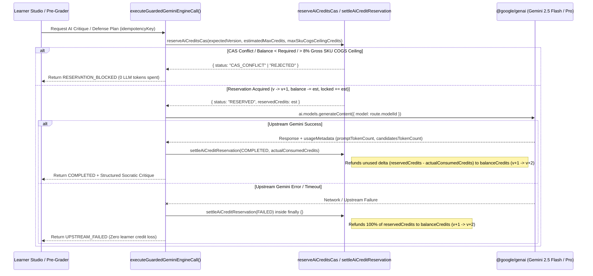
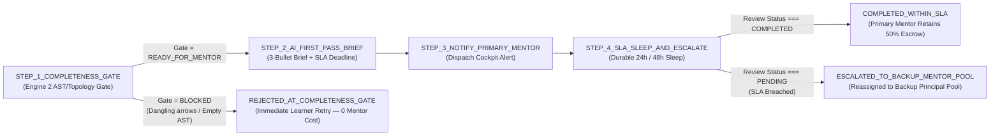

# 03 — Pluggable Work Artifacts, Tiered Gemini AI Economics & Durable SLA Workflows

> **Package Scope**: `@elluminar/domain-artifacts` (`packages/domain-artifacts/src/*`) & `@elluminar/domain-ai-mentorship` (`packages/domain-ai-mentorship/src/*`)

---

## 1. Pluggable Work Artifact Studio Architecture (`@elluminar/domain-artifacts`)

Rather than feeding raw multi-megabyte JSON blobs into LLMs or burning server container compute on interactive Python/SQL playgrounds, Elluminar v2 extracts compact structural ASTs/topologies and executes sandbox runtimes across three cost-isolated tiers.

### 1.1 Excalidraw Architecture Topology & Domain Stencils (`excalidraw.ts`, `stencils.ts`)

- **Structural Graph Extraction (`extractExcalidrawTopology`)**:
  - Filters out soft-deleted scene elements (`!el.isDeleted`).
  - Resolves container-bound text elements (`containerId`) onto shapes (`rectangle`, `diamond`, `ellipse`).
  - Inspects `arrow` bindings (`startBinding.elementId` $\rightarrow$ `endBinding.elementId`) to compute exact `danglingArrowCount` (`isDangling = fromNodeId === null || toNodeId === null`). Broken diagrams with unbound arrows are deterministically blocked at Engine 2's Completeness Gate before consuming human mentor time.
- **Domain Stencil Packs & Socratic Node Highlighting (`stencils.ts`)**:
  - Ships curated `DISTRIBUTED_BACKEND` (`api_gateway`, `load_balancer`, `kafka_cluster`, `redis_cache`, `sharded_postgres`, `cdn_edge`) and `AGENTIC_RAG` (`chunking_worker`, `embedding_model`, `vector_db_hnsw`, `hybrid_reranker`, `semantic_cache`, `guardrail_router`) stencils via `instantiateStencilElement`.
  - `injectSocraticHighlightsOntoScene` overlays Socratic feedback (`CRITICAL_GAP`, `BOTTLENECK_WARNING`, `VALIDATED_STRENGTH`) directly onto canvas node stroke/background colors while normalizing prompts to end with a `?` so AI never hands over turnkey answers.

### 1.2 Univer Spreadsheet Formula vs. Hardcoded AST Inspector (`spreadsheet.ts`)

Financial and quantitative models (e.g., Discounted Cash Flow / SaaS cohort retention sheets) often look visually correct when learners hardcode terminal numbers instead of writing dynamic formulas.
- `extractSpreadsheetFormulaAst(workbook)` parses every cell across all sheets in a `UniverWorkbookPayload`:
  - Classifies cells starting with `=` as `DYNAMIC_FORMULA` (extracting function identifiers like `NPV`, `IRR`, `SUM` and cell range references like `B2:G2`).
  - Classifies static literal cells as `HARDCODED_VALUE` and computes `dynamicFormulaRatioBps` (`0..10000`).
  - Submissions with `dynamicFormulaCells === 0 && hardcodedNumericCells > 0` are automatically blocked at Step 1 of the Milestone Pre-Grader.

### 1.3 Three-Tier Code Sandbox Execution Router (`sandbox-protocol.ts`)

`routeAndValidateSandboxExecution` protects platform gross margins by executing Python, SQL, and TypeScript in client-side Web Workers (`$0.00` marginal server compute) while strictly guarding compiled languages on remote stateless runners:

| Execution Tier | Runner Kinds | Marginal Compute Cost | Security & Quota Guards (`DEFAULT_SANDBOX_GUARD_POLICY`) |
| :--- | :--- | :---: | :--- |
| **`TIER_1_BROWSER_WASM`** | `PYODIDE_PYTHON`, `DUCKDB_SQL` | **`₹0.00` (`0n` paisa)** | Isolated client Web Worker (`maxWasmPayloadBytes: 512 KiB`, `timeoutMs <= 15s`) |
| **`TIER_2_BROWSER_BUNDLER`** | `SANDPACK_TS` | **`₹0.00` (`0n` paisa)** | Isolated client iframe/worker bundler (`maxWasmPayloadBytes: 512 KiB`) |
| **`TIER_3_REMOTE_STATELESS`** | `JUDGE0_COMPILED` (`go`, `rust`, `cpp`, `java`) | Bounded stateless container | Strict `maxRemotePayloadBytes: 64 KiB` (`65,536` bytes) + `maxDailyJudge0RunsPerUser: 50` runs/UTC day |

### 1.4 `24kbps Opus` Voice-over-Canvas R2 Replay & 60fps Frame Interpolator (`voice-replay.ts`)

Instead of recording heavy `1080p` MP4 screen videos (`~150 MB` per 8-minute review) and paying cloud video transcoding + egress fees:
1. Mentors record lightweight **24kbps Opus WebM audio** (`~1.4 MB` per 8-minute review) uploaded directly to **Cloudflare R2** (`zero-egress` bandwidth) via presigned URLs (`apps/web/src/server/storage/r2-presigner.ts`).
2. Synchronized viewport & laser pointer keyframes (`CanvasViewportKeyframe`: `{ timestampMs, scrollX, scrollY, zoom, pointerX, pointerY }`) are stored alongside the submission.
3. During learner playback, `interpolateCanvasVoiceViewport(keyframes, targetTimestampMs)` performs $O(\log N)$ binary search (`lo` / `hi`) with linear interpolation (`lerp`) to drive silky 60fps camera pan, zoom, and laser pointer movement synchronized to the audio playhead.

---

## 2. Tiered Gemini Routing & Pre-Call CAS `AiWallet` (`<= 8%` Gross SKU COGS Guard)

### 2.1 Tiered Model Routing & Implicit Rubric Prefix Caching (`engines.ts`)

`selectGeminiModelForEngine` enforces strict model routing across the three pedagogical outcome engines:

| Outcome Engine | Assigned Gemini Model | Credit Rate (`Input / Output per 1k tokens`) | Pedagogical Role & Prompt Architecture |
| :--- | :--- | :---: | :--- |
| **`ENGINE_1_ARTIFACT_CRITIC`** | **`gemini-2.5-flash`** | `2n` / `8n` | Interactive Socratic feedback on Excalidraw topologies & Univer ASTs. Prepends deterministic `formatStaticRubricPrefix` (`=== STATIC RUBRIC CACHE PREFIX ===`) for implicit prefix cache hits. |
| **`ENGINE_2_MILESTONE_PREGRADER`** | **`gemini-2.5-flash`** | `2n` / `8n` | Enforces deterministic pre-submission completeness gates and synthesizes a **3-Bullet Mentor Brief** (`architecturalStrength`, `primaryBottleneckOrRisk`, `suggestedLiveProbeQuestion`) compressing human mentor review from `30m` to `5–8m`. |
| **`ENGINE_3_DEFENSE_GENERATOR`** | **`gemini-2.5-pro`** | `10n` / `40n` | Reserved strictly for high-stakes anti-AI-cheating oral defenses (`buildEngine3AdversarialDefensePlan`). Generates **5 targeted "Why X over Y?" questions** anchored to exact Git diff lines (`filePath:LstartLine`), Excalidraw node IDs, and rubric gaps. |

### 2.2 Pre-Call CAS Wallet Lock & Unused Delta Settlement (`wallet-cas.ts`, `gemini-client.ts`)

To mathematically guarantee that AI compute costs never exceed **`8.00%` (`MAX_GROSS_SKU_AI_COGS_BPS = 800`)** of any enrollment's gross revenue (`computeMaxSkuAiCreditCeiling`), `executeGuardedGeminiEngineCall` executes a strict 3-phase CAS transaction around `@google/genai`:

---

## 3. Upstash Durable `24h` / `48h` Mentor SLA Escalation Pipeline (`sla-workflow.ts`)

Human mentorship on Elluminar v2 carries an explicit turnaround SLA (`computeMilestoneSlaDeadline`):
- **`TIER_2` (Intensive Project Cohort)**: **`24 Hours` (`86,400` seconds)**
- **`TIER_1` (Guided Foundation Track)**: **`48 Hours` (`172,800` seconds)**

`orchestrateMilestoneReviewPipeline` coordinates a fault-tolerant 4-step durable workflow bound to `@upstash/workflow`:

